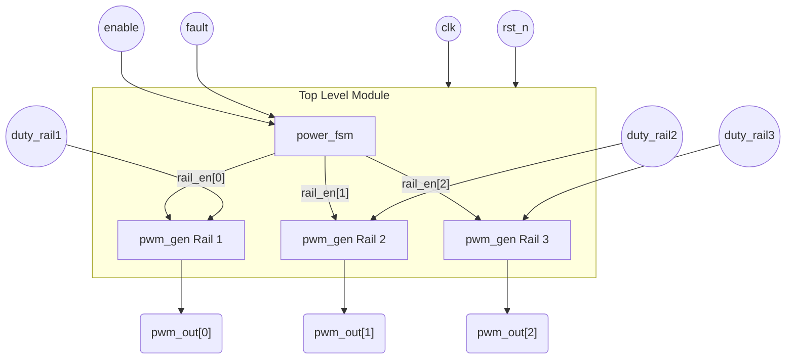
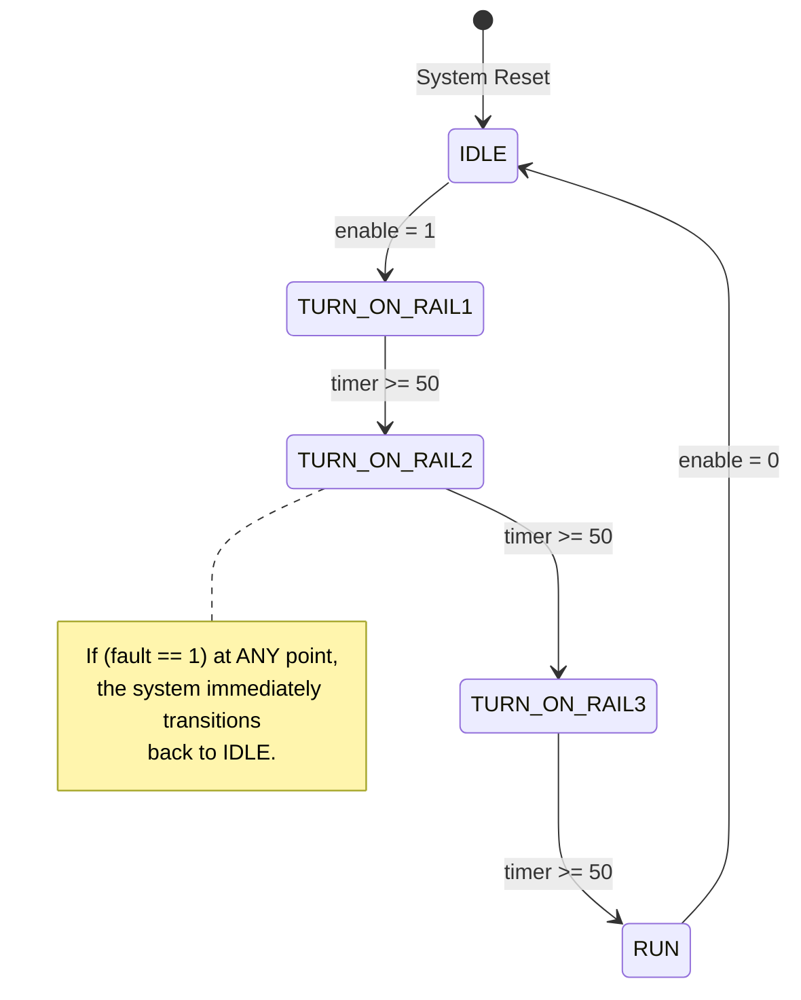
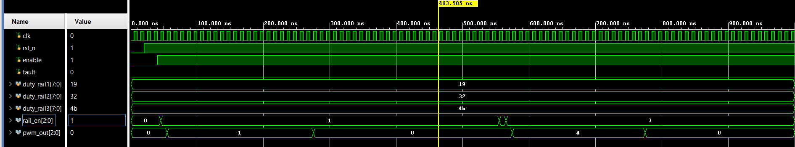
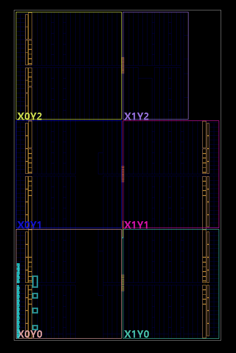
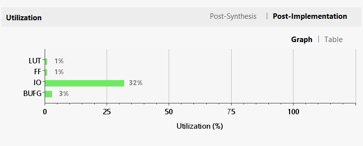
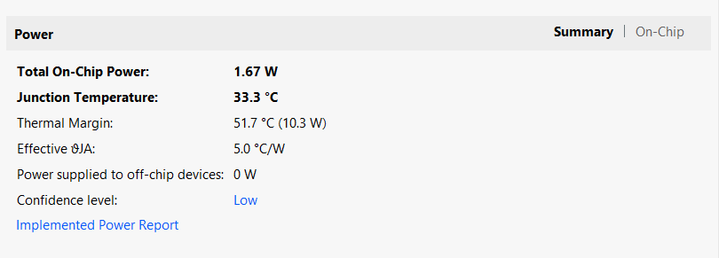

# Basic Digital PMIC Controller

**Author:** Pradyumna Veer Verma


This repository contains a Verilog-based Digital Power Management IC (PMIC) Controller designed to orchestrate safe power delivery in complex electronic systems. Built from the ground up to demonstrate fundamental digital logic concepts, the project features a parameterized Moore Finite State Machine (FSM) that enforces strict power-up sequencing across multiple voltage rails with built-in stability delays. Additionally, it integrates custom counter-based Pulse Width Modulation (PWM) generators for precise voltage regulation, alongside asynchronous fault-handling logic that guarantees instantaneous system shutdown in the event of over-current or thermal emergencies.

## Features
*   **Power Sequencing**: A Moore FSM that safely sequences three distinct power rails (Core, Memory, I/O) sequentially, incorporating built-in stabilization delays between each stage.
*   **PWM Generation**: Parameterized, counter-based Pulse Width Modulation (PWM) generators assigned to each rail, allowing for variable duty cycle control of connected DC-DC converters.
*   **Fault Protection**: Instantaneous hardware shut-off triggered by an asynchronous fault signal, simulating critical Over-Current or Over-Temperature protection mechanisms.
*   **Educational Codebase**: A streamlined, heavily documented codebase designed specifically for undergraduate studies in digital logic and hardware design.

## Architecture
The project architecture consists of three primary modules interacting as shown below:



### Finite State Machine (Power Sequencer)
The `power_fsm.v` module acts as the master controller. It utilizes a built-in timer to ensure each rail receives 50 clock cycles to stabilize before the subsequent rail is powered. A critical safety constraint ensures that an active `fault` signal will immediately override the current state and force the system into a safe `IDLE` state.



## Quick Start (Simulation)
This design is fully compatible with open-source synthesis and simulation toolchains.

### Prerequisites
*   [Icarus Verilog](http://iverilog.icarus.com/) (Compilation and Simulation)
*   [GTKWave](https://gtkwave.sourceforge.net/) (Waveform Analysis)

### Running the Testbench
1. Clone the repository and navigate to the project directory.
2. Compile the Verilog source files:
   ```bash
   iverilog -o pmic_sim.vvp pwm_gen.v power_fsm.v pmic_top.v tb_pmic_top.v
   ```
3. Execute the simulation:
   ```bash
   vvp pmic_sim.vvp
   ```
4. A waveform dump named `pmic_simple.vcd` will be generated in the root directory.

### Viewing the Waveforms
Open GTKWave and load the generated `.vcd` file:
```bash
gtkwave pmic_simple.vcd
```
*Note: Expand the `tb_pmic_top` -> `uut` hierarchy within GTKWave to observe internal FSM state transitions, PWM outputs, and fault signal triggers.*

## Simulation & Hardware Results

### Waveform Analysis
The following simulation waveform demonstrates the FSM successfully sequencing the three distinct voltage rails, outputting the variable-duty PWM signals, and reacting instantaneously to an asynchronous fault trigger.



### Vivado Implementation
The digital logic is fully synthesizable and can be mapped to physical FPGA hardware using Xilinx Vivado. 

**Device Floorplan View:**
This image details the post-implementation physical placement of the PMIC controller logic onto an Artix-7 FPGA architecture.



**Resource Utilization Report:**
This report demonstrates the minimal logic footprint required to implement the controller, detailing Look-Up Table (LUT) and Flip-Flop (FF) consumption.



**Power Estimation Report:**
The static and dynamic thermal power estimates for the PMIC controller logic when implemented on physical silicon.


