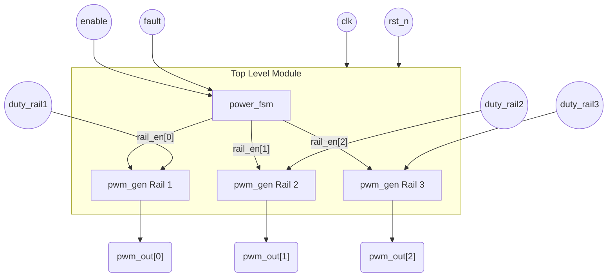
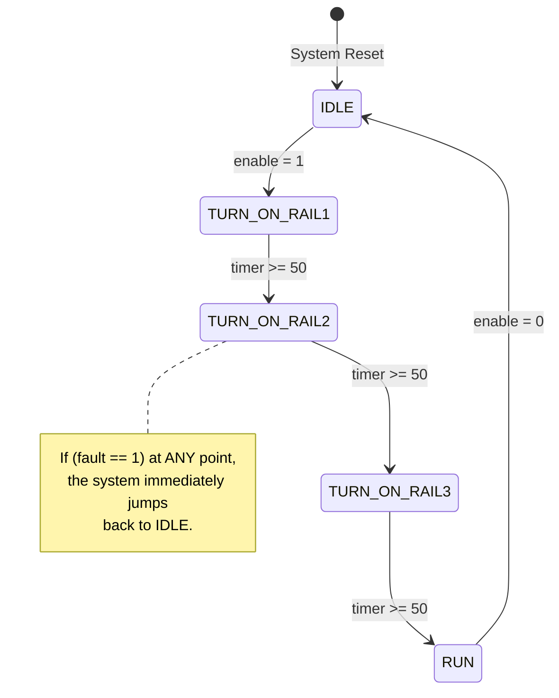

# Basic Digital PMIC Controller


This is an educational hardware design project that demonstrates how to build a **Digital Power Management IC (PMIC) Controller** using Verilog. It serves as an excellent introduction to Finite State Machines (FSM) and hardware counters.

In real-world electronics, complex chips (like CPUs and GPUs) require multiple voltage rails that must be turned on in a specific order to prevent damage. This project acts as a digital "traffic cop," sequencing the power rails and generating the signals that control analog voltage converters.

## 🌟 Features
*   **Power Sequencing**: A Moore FSM that safely sequences three power rails (Core, Memory, I/O) one after the other with built-in timing delays.
*   **PWM Generation**: Parameterized, counter-based Pulse Width Modulation (PWM) generators for each rail to control the duty cycle of connected DC-DC converters.
*   **Fault Protection**: Instantaneous hardware shut-off triggered by an asynchronous fault signal, simulating Over-Current or Over-Temperature protection.
*   **Educational Codebase**: Stripped of complex industry-specific bloat, heavily commented, and designed specifically for students learning digital logic.

## 🏗️ Architecture
The project consists of three main modules interacting as shown below:



### Finite State Machine (Power Sequencer)
The `power_fsm.v` acts as the master controller. It uses a built-in timer to ensure each rail has 50 clock cycles to stabilize before powering the next one. A critical safety feature is that an incoming `fault` signal will instantly override any state and return the system to `IDLE`.



## 🚀 Quick Start (Simulation)
This project is designed to be easily simulated using open-source tools.

### Prerequisites
*   [Icarus Verilog](http://iverilog.icarus.com/) (for compiling and simulation)
*   [GTKWave](https://gtkwave.sourceforge.net/) (for viewing the waveform results)

### Running the Testbench
1. Clone the repository and navigate to the root directory.
2. Compile the Verilog files:
   ```bash
   iverilog -o pmic_sim.vvp rtl/pwm_gen.v rtl/power_fsm.v rtl/pmic_top.v tb/tb_pmic_top.v
   ```
3. Run the simulation:
   ```bash
   vvp pmic_sim.vvp
   ```
4. A waveform file named `pmic_simple.vcd` will be generated in your directory.

### Viewing the Waveforms
Open GTKWave and load the generated `.vcd` file:
```bash
gtkwave pmic_simple.vcd
```
*Tip: Expand the `tb_pmic_top` -> `uut` hierarchy to view the internal FSM states, PWM outputs, and fault triggers.*

## 📈 Simulation & Hardware Results

### Waveform Analysis
This waveform demonstrates the FSM successfully sequencing the three rails, outputting the variable-duty PWM signals, and reacting instantly to a fault trigger.


### Vivado Implementation
The project can also be synthesized and implemented in Xilinx Vivado to map the logic to a physical FPGA.


*Vivado Utilization & Power Reports:*


